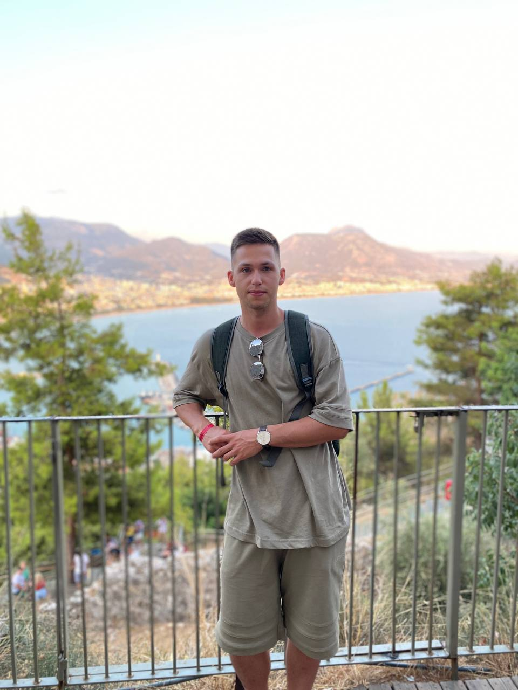

# Welcome to my CV!

## My name is:
__Poleshchuk Vladislav__
*Derrsay(@Dersa)*
***
##  Contacts: 
*Мой email*: Derrsay@yandex.by
*Мой сотовый телефон*: +375 (44) 760-08-25
***
##  About:    
My main goal is to find a job, that will bring me pleasure every day, regardless of the weather, my mood or the fall of meteorite. And no matter what, I will try to improve my professional skills, get better every day, try to learn something new every minute, achieve goals here and now. My priority is to do work qualitatively, fast and right. 

#### Strong points:
- Punctuality
- Self-improvement
- Flexibility
- Sociability
- Team player
- Prioritizing
***
## Work Experience:
- 2 years member of the restaurant crew in  McDonald's
- 2 years hospital nurse in BSMP
- 3 years pediatrician
- 3 month self-education HTML, CSS 
- [result of my work](https://github.com/Derrsa/Example-of-my-work)
***
##  Skills:
- Basic Python
- HTML, CSS
***
## Code example:
```
def multiple(a,b):
    c = a * b;
    return c;
```
***
## Education:
Belarusian  state medical universitet
***
## Languages: 
- Russian fluent
- StreamLine 1 year Pre-Intermediate